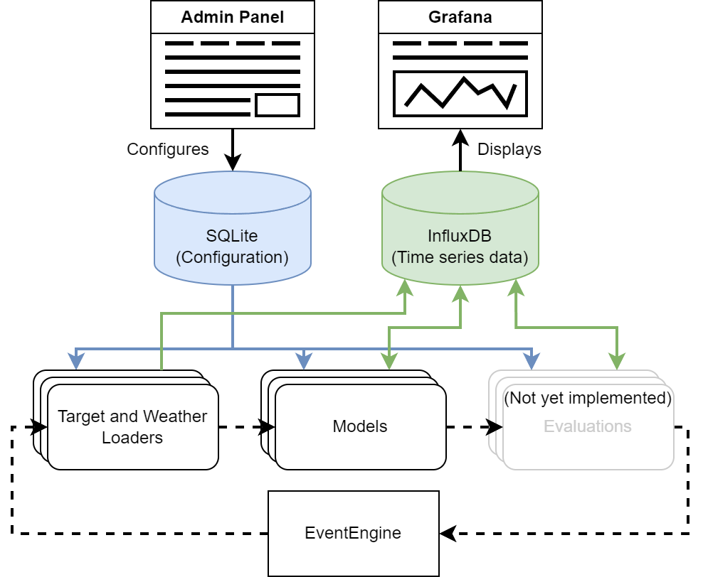

# PV-Forecast Server

Welcome to the Phorecast project, a comprehensive framework designed to predict solar 
power generation using advanced machine learning techniques, specifically focusing on recurrent 
neural networks (RNNs). The objective of this project is to provide a robust, flexible, and scalable
solution for solar power (PV) forecasting that can be easily extended to incorporate additional features 
and data sources.

<h3>Table of Contents: </h3>


<!-- TOC -->
1. [Motivation](#motivation)
2. [Quick Start](#quick-start)
3. [Project Structure](#project-structure)
4. [System Architecture](#system-architecture)
   * [DB Concept](#db-concept)
     * [Configurable Components](#configurable-components)
       * [General](#general)
       * [Loaders](#loaders)
       * [Models](#models)
<!-- TOC -->

<h3>Important Links: </h3>
<h4>Contributing Guidelines: [CONTRIBUTING.md](CONTRIBUTING.md) </h4>
<h4>API Reference: [API Reference](docu/api/openapi.yaml)</h4>
<h4>Tutorials for configuring and extending the Project: [Tutorials](docu/tutorials/Tutorials.md)</h4>
<h4>License: [LICENSE](LICENSE)</h4>
<h4>Compose Configuration (Production): There will be a deployment ready compose configuration with 
reverse proxy and pre installed dashboard</h4>


## Motivation
Accurate solar power forecasting is critical for optimizing the operation of solar energy systems 
and enhancing grid stability. With the increasing adoption of renewable energy sources, the ability 
to predict power output accurately can lead to more efficient energy management, reduced operational 
costs, and better integration with the power grid. The idea behind this project is to leverage ML 
for this task, as it can capture complex patterns in the data and hopefully provide accurate 
predictions. Additionally, the use of ML reduces the amount of manual work needed to create an 
accurate prediction, since it can learn from the data itself. Another advantage of using ML is that 
the framework can accept a datasource from an inverter or installation level and use it to create a 
prediction. This allows the framework to be used in a wide range of applications, from small to big
installations without the need for a complex configuration.

## Quick Start
1. Install docker and docker-compose on your machine. Then run the following commands in the root
\
--> [Docker docs Install Guide](https://docs.docker.com/engine/install/)

2. Modifiy the .env file to your needs, the default values should work for a local setup.
3. Run the following two commands in the root directory of the project:
```bash
docker-compose build #builds the image from the Dockerfile
```
```bash
docker-compose up #deploys the image in a docker-compose configuration
```
## Project Structure

### `app/`
Contains the main application code, including the web application built with Flask.

- `templates/`: Directory for HTML templates used by the Flask app.
- `__init__.py`: Initializes the Flask app.
- `auth.py`: Handles authentication logic.
- `main.py`: Contains the main routes and views for the web application.
- `models.py`: Defines the data models used by the Flask application (only auth data).
### `data/`
Stores data files required by the application. THis folder should contain all the data which is 
non-static and should not be volatile. This is so that all the data can be backed up and persistent 
docker volumes can be created easily.

- `model-data/`: Contains data related to model training and predictions.
- `server-data/`: Stores server-specific data files.

### `docu/`
This directory is intended for documentation files e.g. diagrams, images, examples, and other,
providing detailed guides and references for the project.

### `resources/`
Contains static resource files such as configuration files, scripts, and other necessary assets.

### `src/`
The main source directory for the core components of the project.

- `configurable_components/`: Houses modular components that can be configured and extended.
  - `models/`: Machine learning models for forecasting.
  - `target_loaders/`: Components responsible for loading target data.
  - `weather_loaders/`: Components for loading weather data.
  - `adapter.py`: Interfaces and SQLAlchemy adapters for the components.
  - `exceptions.py`: Custom exceptions and logging utilities for them, used in components.
- `database/`: Code related to database interactions and management (mainly focused on InfluxDB).
- `engine/`: Contains the core engine logic that drives the event loop
- `utils/`: Utility functions and helpers used across the project.


### `tests/`
Contains unit tests and integration tests to ensure the correctness of the project’s codebase.

### Root Files

- `.editorconfig`: Defines coding styles for the project (Please activate this config in your editor 
of choice to ensure consistent code).
- `compose.yml`: Docker Compose file for setting up the development environment.
- `Dockerfile`: Dockerfile for building the Docker image of the project.
- `requirements.txt`: Lists the Python dependencies for the project.
- `setup.cfg`: Configuration file for Python packaging.

## System Architecture
The system architecture of this project is designed to support the entire lifecycle of: 
1. Data ingestion (pv and weather data)
2. Processing, model training, and inference. 
3. Evaluation and monitoring of the forecasting performance. (not yet implemented)

(these 3 steps are implemented by 4 types components explained in detail later)

Some of the enabling technologies, components and paradigms used in this project include:

- **Deployment:** Docker Compose is used to containerize and manage the entire application stack. 
This approach simplifies deployment, scalability, and maintenance by encapsulating the dependencies
and configurations within Docker containers. This includes the main server application in this 
repository using the gunicorn WSGI implementation. An InfluxDB container for time series data.
Optionally a Grafana container for visualization of the data with a preconfigured dashboard and a 
nginx proxy server. 


- **Data Management:** The project uses InfluxDB, a high-performance time series database, to store 
and manage time series data such as PV output, weather data, and generated 
predictions. This database is well-suited for handling the large volumes of data typically 
associated with solar power forecasting.
 

- **Configuration Management:** SQLite is utilized for managing configuration metadata. 
This lightweight database ensures that configuration settings and parameters for components are 
stored efficiently, facilitating easy retrieval and updates.


- **Web Interface:** A Flask application provides a user-friendly web interface for managing 
components. It includes CRUD (Create, Read, Update, Delete) operations, allowing users to configure 
and control components and other aspects of the forecasting system.


- **Visualization:** 
Grafana can be integrated into the system to provide rich, interactive visualizations of the data 
and predictions. This helps users to monitor system performance, track forecast accuracy, and gain 
insights into the underlying data trends.


- **Event Engine:**
The application features a loop-driven architecture managed by the event_engine. 
This engine orchestrates the lifecycle of various components, ensuring timely data ingestion, 
processing, and prediction generation.
<p align="center">

</p>

The provided diagram illustrates a simplified version of the event loop. At the core of the system 
is the EventEngine, which orchestrates the various components involved in the forecasting process. 
The Admin Panel allows users to configure the system, with configuration data stored in an SQLite 
database. The components are created from the configuration and executed in parallel and in sequence
by category: first all Weather and Target Loaders are executed, then all Models.

The ingested data is then stored in InfluxDB, a time series database, where it can be efficiently 
managed and accessed. The Models component utilizes this data to perform machine learning tasks, 
generating forecasts based on historical and real-time data inputs. The results and ongoing data can
be visualized in Grafana.
### DB Concept
The Solar Power Forecasting project employs a sophisticated database design to efficiently manage 
and utilize data for accurate solar power predictions. The system uses a combination of SQLite and 
InfluxDB to handle different aspects of data management. SQLite is utilized for managing 
configuration data as well as metadata for the time series data, while InfluxDB is used to store and 
manage time series data, such as PV output and weather forecasts. 
This dual-database approach ensures both flexibility and performance in handling the various data 
requirements of the system.

For all Time Series Data stored in the Influx db the following rules apply: 

1. All data is stored in hourly intervals with the timestamp being at the full hour.
2. Measurements like the Temperature which are sampled are stored with the timestamp of the measurement. If a measurement is not at the full hour, it should be aligned to the next full hour. e.g. if something is measured at 12:23 it should be stored at the 13:00 timestamp. 
3. Measurements over time like mm of rain fallen in a set period should be stored as aggregate over an hour with the timestep being aligned right. e.g. if 5mm of rain fell between 12:01 and 13:00 it should be stored at the 13:00 timestamp.


Every component has an id, a name (given by the user) and a type (SQLalchemy internal). 
As well as an error string to save errors that occur during the execution of the component, if the
component was executed successfully the last_execution field is updated with the current time.
The individual components are described in detail in the following sections.


A Target Loader has a Field(s) to connect it with the InfluxDB. The field is connected to a 
pv_measurement by the influx_field which matches the field name in the InfluxDB. (external_field can
be used to match a external resource if needed).


A Weather Loader has a Cell(s) to connect it with the InfluxDB. The cell id with the loader id 
matches appropriate tags in the weather_forecast measurement in the InfluxDB. The Weather Loader 
also stores geographical information about the location of the weather data. The weather data also 
has a tag for the name of the model as well as the run, which is the timestamp of the forecast in 
YYYYMMDDHH format. The Cell stores the latitude and longitude of the location of the weather data,
and an additional pair if grid data to define the rectangle in which the weather data is valid. The
member number is used to identify the member of the ensemble forecast.


The Model has a Weather loader related to it, as well as a Field. The Model will use the  
geographical from the Weather loader. The Field is used to connect the model with the pv_measurement
which will be used for training. If the Model is trained a new ModelRun is created, storing a error
measurement (loss) to measure the performance of the model, a timestamp, and a path to a folder to 
store artefacts.

### Configurable Components
This is the part of the system that can be configured by the user, and is designed to be extended by
other contributors. 


This section will provide an overview of the structure and functionality of these components, 
however to get more detailed information about the implementation of the components, please refer to
the [reference documentation](docu/api_reference.md) and the [contributing guidelines](CONTRIBUTING.md).

The components are:
- **Target Loaders:** Responsible for ingesting data from external sources providing a target 
variable to be predicted by the models. In this stage this is mainly the power output of a solar 
installation.
- **Weather Loaders:** Analogous to the target loaders, these components ingest weather data that is 
later used as input to the models.
- **Models:** The core of the forecasting system, these components are responsible for training a ML
model on the data provided by the target and weather loaders, and inferencing on the data. 
- **Evaluators:** These components are designed to evaluate the performance of the models, but are 
not yet implemented.


#### General
All components have a name, a error string and a last_execution timestamp. The name is given by the
user and is used to identify the component. The error string is used to store a hint of what went 
wrong to the user. The last_execution timestamp is used to store the last time the component was
executed successfully. 

The component has a _FlaskForm_ as a class variable, which references the form used to configure the
component. the form is used by last two methods explained below.

``
get_component_info(self) -> ComponentInfo:
``

This method is used to get the information of the component. The ComponentInfo class is a named 
tuple defined in _database/data_classes.py_. it contains the 'name', 'type', 'id', 'status' 
and 'last_execution'.
  
``
def get_form(cls, obj: "ComponentInterface" = None) -> FlaskForm:
``

Get the form for the component, if obj is given the form is filled with the object's data. (prefill 
only works on matching field names.)
Has to be overwritten if the form has select fields with non-static values to be filled on
runtime.

``
def from_form(cls, form: FlaskForm) -> "ComponentInterface":
``

Create a new component from the form data, default implementation to be overwritten if needed:
In this impl. the form data is keyword matched with the objects, that only works if the
Object has the exact named fields as the form.
If this cant be done e.g. if a field has to be created at runtime or from additional data,
this method has to be overwritten.


#### Loaders
Weather Loaders and Target Loaders function in the exact same way, but the classes are separate to 
ensure flexibility later on (for now they implement the same logic).

A Loader additionally has a _Field_ or _Cell_ which is used to store metadata about the time series 
data which the Loader will produce. When using the InfluxInterface this data has to be passed to the
appropriate methods.

``
run(self):
``

This method is used to run the loader, it is executed by the event engine. It handles the errors 
occurring in the following 3 methods as well as the setting of the last_execution timestamp and the 
error field. 

``
def _execute(self):
``

This Method should be overwritten by the actual implementation, it contains the actual execution 
logic e.g.:
- e.g. fetching data from an API
- pre-processing the data
- storing the data in the database

``
    def _pre_execute(self):
``

This Method should be overwritten by the actual implementation, it contains the pre-execution 
logic e.g.:
- checking if the API is reachable
- checking if the database connection is working
- logging in

``
    def _post_execute(self):
``

This Method should be overwritten by the actual implementation, it contains the post-execution 
logic e.g.:
- logging out
- closing the database connection

#### Models

Model function in a similar way to the Loaders, but have the ``train()`` and ``predict()`` methods 
as their main execution functions which can be. The main function to execute the model is the 
``execute()`` function which intern calls the ``train()``  if the ``retrain`` property is true. 
Afterward the ``predict()`` function is called.

The model has a _Field_ which is used to retrieve the Target data (PV power output) and a _WeatherLoader_ which is used
to retrieve the Weather data (It also gives geographical information to the model). The model also 
has a list to store the ModelRuns which are created when the model is trained. They store a score 
and a timestamp to rank the different runs, as well as a path to a folder which stores the runs 
artefacts.

Notable methods and properties are:

``def create_new_run_dir(self) -> str:``

This method is used to create a new directory for the model run, it should be called in the train 
method when needed and the path given back should be stored in the ModelRun object.

``def get_best_run(self, best_of: int = None) -> ModelRun | None:``

Returns the best run of the model, if best_of the run with the lowest loss of the x last runs is 
returned.

``def train_data(self) -> pd.DataFrame:``

Default property to return the training data, should be overwritten if the model needs a different
approach.


``def missing_runs(self) -> [int]``

Gives back run id for weather forecast which do not have a forecast yet.
