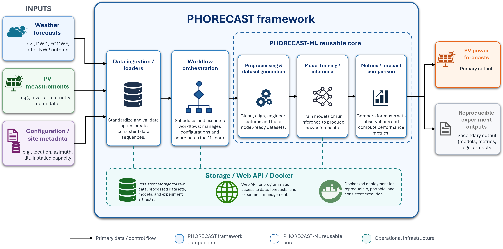
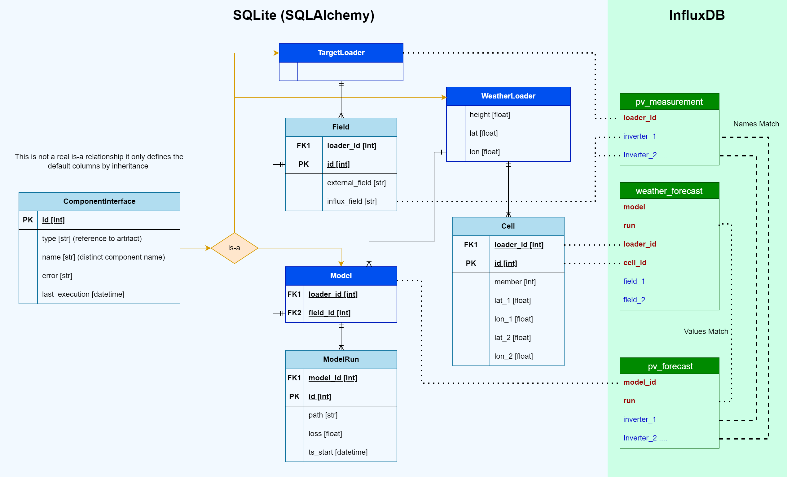

[](https://github.com/smart-resource-management-trier/phorecast/actions/workflows/docker-image.yml)

# PHORECAST
The repository contains the PHORECAST software, documentation, and an accompanying research paper describing the framework. The paper is maintained in [`paper/paper.md`](paper/paper.md), with references in [`paper/references.bib`](paper/references.bib).
## Repository Scope

The PHORECAST ecosystem uses two repositories:

| Repository | Role | Typical path |
| --- | --- | --- |
| `phorecast` | Full forecasting framework, including orchestration, database integration, web/API interface, Docker deployment, documentation, and the JOSS paper. | Docker/Compose full-framework usage |
| [`phorecast-ml`](https://github.com/smart-resource-management-trier/phorecast-ml) | Reusable Python package for preprocessing, dataset generation, metrics/losses, and LSTM-based forecasting functionality used by `phorecast`. | Python package usage |

Users who want the full framework should start with this repository. Users who only need the reusable machine-learning core can install and use `phorecast-ml` independently.

## Motivation

Photovoltaic power generation is variable because it depends on weather, daylight, site conditions, and the technical state of the installation. Forecasts help grid operators, energy suppliers, and PV system operators plan around this variability.

PHORECAST focuses on workflows where PV measurements and weather forecasts are combined to train and run machine-learning forecasting models. The framework stores time-series data, manages configurable data loaders and models, and provides a web interface for configuring and inspecting forecasting runs.

The project is designed for installation-level or inverter-level PV data sources. Its configurable component model is intended to make data loaders and forecasting models replaceable without changing the surrounding orchestration and storage workflow.

## Quick Start

The supported full-framework path is Docker Compose. This path starts the PHORECAST application together with the required InfluxDB service and optional Grafana service defined in [`compose.yml`](compose.yml).

Prerequisites:

- Docker
- Docker Compose

From the repository root:

```bash
docker compose build
docker compose up
```

If your Docker installation uses the older standalone Compose command, use:

```bash
docker-compose build
docker-compose up
```

Configuration is read from `.env`. Review and adjust the local values before starting the stack, especially credentials and ports. The default Compose configuration exposes the PHORECAST web application through the `pipeline-server` service and uses InfluxDB for time-series storage.

The production configuration generator in [`create_config.py`](create_config.py) is not the recommended reviewer quick-start path. Use the Compose workflow above for repository review unless a deployment-specific configuration is required.

## Full-Framework Workflow

A typical PHORECAST workflow has the following steps:

1. Configure a target loader for PV power measurements.
2. Configure a weather loader for weather forecast data.
3. Configure a forecasting model that connects a target field with weather data.
4. Train the model on historical PV and weather data.
5. Generate forecasts when new weather forecast runs are available.
6. Inspect forecasts through the web interface, API, InfluxDB, or Grafana where configured.

The manual web-interface tutorial is available in [`docu/tutorials/Tutorials.md`](docu/tutorials/Tutorials.md).

## Documentation and Repository Map

- JOSS paper: [`paper/paper.md`](paper/paper.md)
- Paper bibliography: [`paper/references.bib`](paper/references.bib)
- API specification: [`docu/api/openapi.yaml`](docu/api/openapi.yaml)
- User and extension tutorial: [`docu/tutorials/Tutorials.md`](docu/tutorials/Tutorials.md)
- Architecture diagrams and supporting documentation: [`docu/`](docu/)
- Tests: [`tests/`](tests/)
- Test dependencies: [`tests/requirements-test.txt`](tests/requirements-test.txt)
- Contribution guidelines: [`CONTRIBUTING.md`](CONTRIBUTING.md)
- License: [`LICENSE`](LICENSE)
- Reusable ML package: [`phorecast-ml`](https://github.com/smart-resource-management-trier/phorecast-ml)

## Running Tests

Install the test dependencies from the repository root:

```bash
pip install -r tests/requirements-test.txt
```

Run the test suite:

```bash
pytest
```

Some tests use Docker/Testcontainers to start an InfluxDB container. Docker must be available for those integration tests.

## Project Structure

### `app/`

Contains the Flask application, authentication routes, API routes, web views, and HTML templates.

### `src/`

Contains the framework implementation:

- `configurable_components/`: target loaders, weather loaders, models, forms, and component adapters
- `database/`: InfluxDB interface, validation, and data classes
- `engine/`: event loop that executes loaders and models
- `metrics/`: custom metrics used by the framework
- `utils/`: shared utility functions

### `resources/`

Contains static resource files, including DWD MOSMIX station and parameter metadata.

### `data/`

Stores runtime data used by the application, including model artifacts and server-side state. In Docker usage this path is mounted through persistent volumes.

### `docu/`

Contains diagrams, API documentation, and tutorials.

### `tests/`

Contains unit and integration tests plus test resources.

## System Architecture

PHORECAST is organized around a full-framework layer and a reusable ML core:

- `phorecast` provides data ingestion and loaders, workflow orchestration, storage, web/API access, Docker-based deployment, documentation, and the JOSS paper.
- `phorecast-ml` provides reusable preprocessing, dataset generation, metrics/losses, and model-training/inference functionality.

The full framework supports the lifecycle of PV forecasting:

1. Data ingestion for PV measurements and weather forecasts.
2. Processing, model training, and inference.
3. Forecast storage and access through the application stack.

<p align="center">

</p>

<p align="center"><em>PHORECAST architecture overview: inputs enter through the phorecast framework, which handles ingestion, orchestration, storage, web/API access, and Docker-based deployment; phorecast-ml provides the reusable preprocessing and forecasting core.</em></p>

Evaluation and monitoring components are part of the broader framework direction, but should only be treated as implemented where the repository provides working code and documentation.

### Deployment

Docker Compose is used to run the application stack for full-framework usage. The stack includes the Flask/Gunicorn application and InfluxDB for time-series data. Grafana can be run from the Compose configuration for visualization when configured.

### Data Management

InfluxDB stores time-series data such as PV measurements, weather forecasts, and generated predictions. This fits the hourly time-series structure used by the framework.

SQLite stores application and component configuration metadata. This includes configured components and web-application user data.

### Web Interface and API

The Flask application provides a web interface for configuring components and inspecting application state. The HTTP API exposes forecast data and available fields; its OpenAPI specification is in [`docu/api/openapi.yaml`](docu/api/openapi.yaml).

### Event Engine

The EventEngine orchestrates the component lifecycle. It runs target loaders and weather loaders, then executes configured models. Components are created from configuration stored in SQLite, while ingested and generated time-series data is stored in InfluxDB.

### Database Concept

The framework uses SQLite for configuration metadata and InfluxDB for time-series data. This separates the relatively small configuration state from the larger PV, weather, and forecast time series.

For time-series data stored in InfluxDB, the framework assumes hourly alignment:

1. Data is stored in hourly intervals with timestamps on the full hour.
2. Sampled measurements that do not occur exactly on the hour should be aligned to the next full hour.
3. Measurements aggregated over a period, such as rain over one hour, should use the right-aligned timestamp for that period.



Target loaders connect PV measurement fields to InfluxDB fields. Weather loaders connect weather forecast cells to InfluxDB tags and store location metadata. Models connect a target field and weather loader, train forecasting models, and store model-run metadata and artifacts.

### Configurable Components

The configurable component system is the extension point for the framework:

- **Target Loaders:** ingest external target data, usually PV power measurements.
- **Weather Loaders:** ingest weather forecast data used as model input.
- **Models:** train and run forecasting models using target and weather data.
- **Evaluators:** planned component category for model-performance evaluation; do not treat this as a complete implemented workflow unless documented by the current code.

Each component has a name, status/error information, and a last-execution timestamp. Components use Flask-WTF forms for web-based configuration and SQLAlchemy metadata for persistence.

More detailed extension guidance is available in [`docu/tutorials/Tutorials.md`](docu/tutorials/Tutorials.md) and [`CONTRIBUTING.md`](CONTRIBUTING.md).

## Current Scope and Limitations

- The current full-framework usage path is Docker Compose.
- `phorecast-ml` provides the reusable ML/preprocessing layer used by the framework.
- The concrete forecasting path currently documented in this repository centers on the DWD MOSMIX weather loader and an LSTM-based model workflow.
- Evaluation and monitoring should be described only to the extent supported by implemented code and documentation.
- This README does not claim support for GRU, SVR, CLI execution, JSON ingestion, benchmarking, or a complete evaluator workflow.

## License

This project is licensed under the MIT License. See [`LICENSE`](LICENSE).
