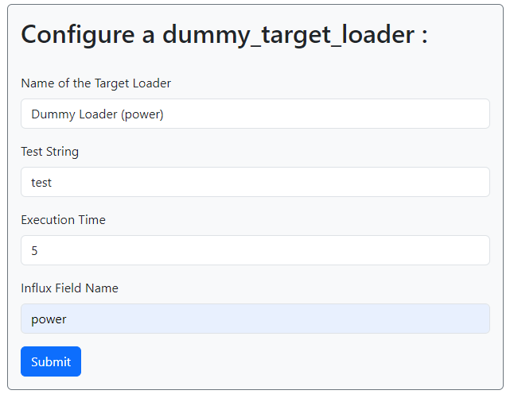
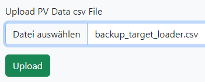
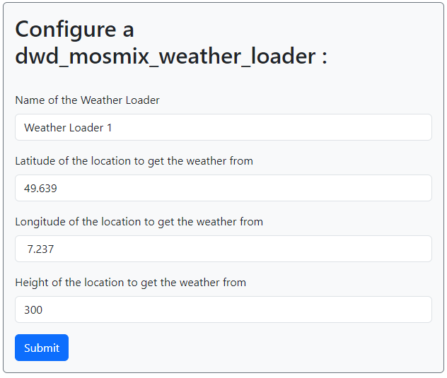
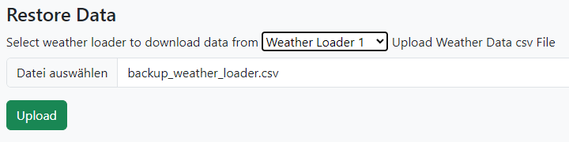
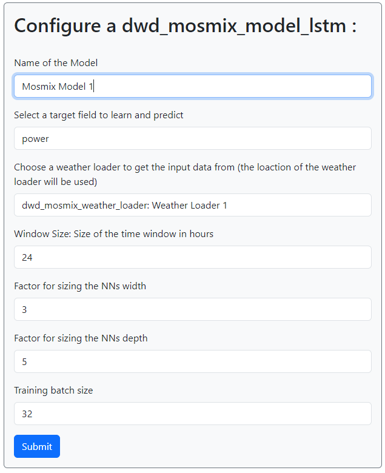

# Usage
## Configuring a new Installation
First follow the Quick Start Guide in the [readme](../../README.md#quick-start) to install and deploy
the software. 

This project tries to get the best predictions by utilizing ML methods, so in order to try it out, we 
first have to preload some data to train on. This is done by ingesting a csv file with backup data
which can be found in the test resource folder.

We start by creating a new Target Loader and Weather Loader to set the metadata needed for the model.

Since this application uses a web interface for configuration and monitoring, open a browser window
and navigate to `http://localhost:5000/` to access it. If initialized the first time, you can log on
with the default credentials:

```username: admin``` 
```password: admin```

You can change the credentials or add new users by clicking on the `New User` or `profile`
button in the top right corner.


### Create a new Target Loader
Since this test does not have a live data source, we will use the dummy target loader for the 
metadata data, in this case it is the name of the solar power input. Look at the csv file for the
target loader: there is a column named `power`, so we have to create a dummy loader specifying this. 

1. Click on the `Target Loaders` tab in the sidebar.

2. Select the `dummy_target_loader` under the 'Create New Target Loader' dropdown and click `create`.

3. Fill in the form with the following values and `Sumbit`:



- `Name`: you can give any name you want this is only for reference.
- `Execution Time`: Time the dummy loader simulates the data retrival
- `Influx Field Name`: Name of the value to predict, in this case `power`
- 
4. You should now see the new target loader in the list of target loaders.

5. Click on the `Data Import/Export` button on the navbar.

6. Upload the target backup csv under the PV data section [(tests->resources->backup_csv)](../../tests/resources/backup_csv).



## Create a new Weather Loader
For the weather data loader we can create a normal loader, since the weather data is sourced from 
the DWD file server which is freely accessible. 

1. Click on the `Weather Loaders` tab in the sidebar.
2. Select the `dwd_mosmix_weather_loader` under the 'Create New Weather Loader' dropdown and click `create`.
3. Fill in the form with the following values and `Sumbit`:



This is an imaginary PV-Installation near the City of Hoppstädten-Weiersbach (49.639, 7.237) in Germany. The geographical 
position is needed to get the weather data from the DWD server, as well as for the model, since it 
can calculate the sun position based on the geographical position.

4. You should now see the new weather loader in the list of weather loaders.
5. Click on the `Data Import/Export` button on the navbar.
6. Upload the weather backup csv under the 'Restore data' section.



## Create a new Model

1. Go to the `Models` tab in the sidebar.
2. select the `dwd_mosmix_model_lstm` from the dropdown and click `create`.
3. Fill in the form with the following values and `Sumbit`:



Here you have to reference the target loader and weather loader you created before. First select the
`power` target field from the dropdown, then select your Weather loader. For the rest of the values, 
the default will do. 

4. You should now see the new model in the list of models.
5. Click on the `View` button next to your Model.
6. Click on the `Train` button to train the model on the data.
7. After the training is done, you can should see a new training run on the `View` page of your model.

The model is now trained and should automatically start predicting the power output every time a new 
weather forecast is retrieved from the DWD server. You can view your predictions by using Grafana or 
the Influx db web Interface. If no new forecasts are create you can see error occurring in the 
components under the `Error Log` tab.

# Contribution

## Setting up a Development Environment
To contribute to the project you may need an development environment to test your changes outside of
docker production environment. To do this you need to install the required dependencies with pip as
well as the modify the .env file.

1. Install the required dependencies with pip:
```bash
pip install -r requirements.txt
```
2. Change the .env file to use the development configuration (also add a token):
```bash
DOCKER_INFLUXDB_INIT_HOST=localhost
```
3. Start the influxdb with the following command (only start the influx db container from compose):
```bash
docker-compose up influxdb
```
4. Start the flask server with the following command:
```bash
flask run app
```
Make sure to load the .env file in your local environment before running the server.

This will start the flask server on `localhost:5000` and you can access the web interface from your
browser. For debugging errors outside the component scope use ```flask run app --debugger``` to get
the full stack trace of any error occurring in the application.

## Creating a new Target Loader
create a new file in the `src/configurable_components/target_loaders` ending with target_loader.py
```python
from src.configurable_components.target_loaders.base_target_loader import TargetLoaderForm, TargetLoader, field_name_not_existing
from src.database.influx_interface import influx_interface
# import some required libraries

class InfluxTargetLoader(TargetLoader): # inherit from the base class
```
Now you need to set some important attributes for the SQLAlchemy schema:

```python
FORM = YourLoaderForm  # will be explained later 

# give the table a name ending with _target_loader make sure it is unique
__tablename__ = 'your_target_loader' 

# this is needed for the polymorphic inheritance has to be the same as table name
__mapper_args__ = {"polymorphic_identity": "your_target_loader"} 

# this is the key for joining the table which is all handled by SQLAlchemy but has to be set here
id: Mapped[int] = mapped_column(ForeignKey("target_loader.id"), primary_key=True)
```

With the mandatory attributes set you can now start modelling your target loader refer to the 
[SQLAlchemy Guide](https://docs.sqlalchemy.org/en/20/) for instruction how to define columns:

```python
# Define your colums which contain data which is not volatile and should be stored in the database.
# The columns are defined as class attributes and have to be of type Mapped[Type] where Type is the
# SQLAlchemy type you want to use. You NEED to use the Mapped type hint else SQLAlchemy will ignore them

api_login_name: Mapped[str] = mapped_column(String(300))
token: Mapped[str] = mapped_column(String(100))
some_other_important_value: Mapped[str] = mapped_column(Float(100))

# Define fields which are used by the loader througout the lifecycle which do not have to be saved.
# client: SomeDBClient = None
```

Now you have to implement the logic needed for the loader to function. This is done by implementing
the following three methods:

```python
import pandas as pd


def _execute(self):
  """
  Method to be implemented by the subclass, which contains the actual execution logic
  - e.g. fetching data from an API
  - pre-processing the data
  - storing the data in the database
  """
  self.client = SomeDBClient()  # example for a client
  self.client.login(self.api_login_name, self.token)  # example for a login


def _pre_execute(self):
  """
  Method to be implemented by the subclass, which contains the pre-execution logic
  - e.g. checking if the API is reachable
  - checking if the database connection is working
  - logging in
  """
  # use the influx interface to check for existing data
  influx_field = self.fields[0].influx_field
  _, ts = influx_interface.get_last_entry_of_pv_measurement(influx_field)
  
  # e.g. fetch data from a api and convert it to a dataframe with the field name as column name
  data = self.client.fetch(from=ts)  
  df = pd.DataFrame({influx_field:data})
  
  # write the data to the database
  influx_interface.write_pv_data(df, self.id)


def _post_execute(self):
  """
  Method to be implemented by the subclass, which contains the post-execution logic
  - e.g. logging out
  - closing the database connection
  """
  self.client.logout()
```
You can look at the existing target loaders for reference on how to implement the methods. 
Also look for the code documentation of the influx interface to understand how to interact with the
database. It is advised to capture expected exceptions and reraise them as ComponentError with a human
readable error message, to make troubleshooting more pleasant for the average user.
