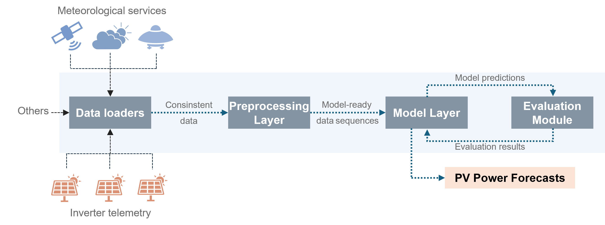

# Summary

Accurate forecasting of photovoltaic (PV) power generation is crucial for efficient energy management, grid stability, and the economic integration of renewable sources into modern power systems. **PHORECAST** is an open-source software framework for photovoltaic power forecasting with machine learning. It combines PV-specific data ingestion, configurable preprocessing, model training, and evaluation in a reusable workflow.

The framework supports heterogeneous inputs such as inverter telemetry, meteorological data, and file-based datasets, and provides implementations of forecasting models including LSTM, GRU, and SVR. PHORECAST follows a configuration-driven design aligned with Machine Learning Operations (MLOps) practices, enabling reproducible experiments, benchmarking, and deployment-oriented workflows.

A key characteristic of PHORECAST is the separation between a reusable forecasting core (`phorecast-ml`) and optional deployment infrastructure, allowing both lightweight research usage and production-oriented operation.

# Statement of need

Renewable energies such as photovoltaics (PV) are a key pillar of the energy transition and play a central role in the transformation towards a climate-neutral energy system. One of the greatest challenges in integrating solar power into existing energy systems is its inherent variability. PV generation depends strongly on meteorological and temporal factors: output is limited to daylight hours and is further influenced by parameters such as solar irradiance, ambient temperature, module tilt, surface soiling, and technical condition of the installation [@Iheanetu_2022].

This variability affects several layers of the energy market. Grid operators rely on accurate PV power forecasts to anticipate fluctuations in generation, balance supply and demand, and reduce the need for costly reserve power plants, thus supporting system stability [@Ahmed_2020]. Energy suppliers and traders use forecasts to integrate expected PV generation into bidding strategies, reduce risks in electricity markets, and optimize economic decisions [@Ahmed_2020]. Prosumer households and businesses benefit from forecasts by aligning consumption patterns with high-production periods, thereby maximizing self-consumption, reducing grid dependence, and improving battery utilization [@Luthander_2015].

From a methodological perspective, PV forecasting approaches can be categorized into statistical time-series methods, physical models, and hybrid approaches [@Sobri_2018]. Machine learning models such as ANN, SVM, LSTM, and GRU have shown strong performance for capturing non-linear temporal dependencies [@Iheanetu_2022].

Despite existing tools, there remains a need for an open, domain-specific, and reproducible framework that integrates PV data handling, preprocessing, forecasting, and evaluation into a unified and reusable workflow. PHORECAST addresses this gap.

# State of the field

Several established tools address parts of the PV and forecasting workflow. `pvlib python` provides a widely used foundation for modeling PV system performance with a focus on physical modeling approaches [@Anderson2023]. `pvOps` supports empirical analysis of PV field data and operational datasets [@Bonney2023]. General-purpose time-series libraries offer forecasting models and APIs but lack domain-specific integration for PV systems.

PHORECAST differs from these tools by integrating PV-specific data ingestion, preprocessing, and machine learning forecasting into a unified and reusable pipeline. A key distinction is the introduction of the standalone Python package **`phorecast-ml`**, which encapsulates the forecasting core independently of infrastructure components.

This design enables users to interact with the forecasting functionality directly through Python or CLI interfaces without requiring database integration. The broader PHORECAST framework extends this core with orchestration and deployment features, making it suitable for both research and operational contexts.

# Software design

PHORECAST is structured into four main subsystems: Data Loaders, Preprocessing, Model Layer, and Evaluation. These components form a modular pipeline that reflects the typical workflow of PV forecasting.

A central design decision is the separation of concerns between forecasting logic and infrastructure. The core functionality is implemented in the standalone Python package **`phorecast-ml`**, which provides:

- Data ingestion from CSV/JSON and other sources  
- Preprocessing pipelines (normalization, imputation, feature extraction)  
- Model training and inference (LSTM, GRU, SVR)  
- Evaluation metrics (RMSE, MAE, MAPE)  

This package can be:
- installed independently,
- imported as a Python library,
- executed via a command-line interface (CLI),

without requiring a database or containerized environment.

The full PHORECAST framework builds on top of this core and adds optional infrastructure such as Docker-based deployment, database integration, and monitoring tools. This layered design enables two usage modes:

1. **Lightweight mode:** direct usage of `phorecast-ml` for research and experimentation  
2. **Deployment mode:** full system with orchestration and infrastructure  

This separation improves modularity, reusability, and reproducibility while maintaining flexibility for real-world applications.

# Research impact statement

PHORECAST provides a reusable software foundation for photovoltaic forecasting research. By separating the forecasting logic into the standalone `phorecast-ml` package, the framework enables users to apply forecasting pipelines independently of deployment infrastructure.

This modular approach addresses a common limitation in research software, where code is tightly coupled to specific environments or data systems. By enabling installation, import, and execution without database dependencies, PHORECAST improves reproducibility and portability.

The framework is publicly available, version-controlled, and designed for extensibility. It supports consistent experimentation and facilitates the comparison of forecasting approaches across datasets and configurations. As the modular core continues to mature, PHORECAST is positioned to support both research applications and integration into operational energy systems.

# AI usage disclosure

Generative AI tools were used during the revision of this manuscript to support language editing and restructuring. All technical content, design decisions, and scientific claims were reviewed and validated by the authors.

# Acknowledgements

The authors thank the [Smart Resource Management research group at Trier University](https://github.com/smart-resource-management-trier) for feedback during development and acknowledge funding from the Ministry for Climate Protection, Environment, Energy and Mobility of Rhineland-Palatinate (MKUEM).
